# Feature 实现工作流

```mermaid
flowchart TD
    A([🚀 开始：明确需求]) --> A1[涉及哪些数据实体？\n新建还是复用 DB 表？\n入口：新路由 / 扩展 / 纯前端？]
    A1 --> B

    B["📐 阶段 1：Schema 定义（数据契约）\n─────────────────────────────\nSkill: zod-infer-type-best-practice\n       schema-best-practice\n       db-table-best-practice\n─────────────────────────────\n✦ 用 Zod 定义数据实体 Schema\n✦ z.infer 派生类型，禁建 types.ts\n✦ 确认 DB 表命名规范"]
    B --> B_gate{门控：Schema 已建立\n无独立 types.ts / types/}
    B_gate -- ❌ --> B
    B_gate -- ✅ --> C

    C["🗄️ 阶段 2：数据层（DAO）\n─────────────────────────────\nSkill: dao-best-practice\n       repository-best-practice\n─────────────────────────────\n✦ 创建 DAO，实现 CRUD\n✦ 方法签名引用 Schema 派生类型"]
    C --> C_gate{门控：DAO 命名 / 类型\n/ 错误处理符合规范}
    C_gate -- ❌ --> C
    C_gate -- ✅ --> D

    D["⚙️ 阶段 3：服务层（Service / tRPC）\n─────────────────────────────\nSkill: service-best-practice\n       implement-trpc-query\n       check-refine-trpc\n─────────────────────────────\n✦ Service 封装业务逻辑\n✦ 暴露 tRPC query / mutation\n✦ check-refine-trpc 检查"]
    D --> D_gate{门控：接口已通过\n实际调用验证}
    D_gate -- ❌ --> D
    D_gate -- ✅ --> EF

    subgraph EF["⚡ 阶段 4 + 5（可并行）"]
        direction LR
        E["🗃️ 阶段 4：状态层（Store）\n─────────────────────\nSkill: store-best-practice\n  use-store-not-props\n─────────────────────\n✦ 按需创建 Zustand store\n✦ 类型引用 Schema 派生"]
        F["🖥️ 阶段 5：UI 层（Page / Component）\n─────────────────────\nSkill: page-best-practice\n  component-unit-best-practice\n  one-component-per-file\n  form-best-practice\n─────────────────────\n✦ Page Wrapper + Content\n✦ 每文件一组件\n✦ 表单绑定 Schema 校验"]
    end
    EF --> EF_gate{门控：check-components ✅\nStore 无多余 props 传递}
    EF_gate -- ❌ --> EF
    EF_gate -- ✅ --> G

    G["🎨 阶段 6：样式与图标\n─────────────────────────────\nSkill: refactor-classname\n       svg-icon-best-practice  check-svg\n─────────────────────────────\n✦ className 全部用 cn()\n✦ SVG 图标符合规范"]
    G --> G_gate{门控：check-svg ✅\n无裸模板字符串 className}
    G_gate -- ❌ --> G
    G_gate -- ✅ --> H

    H["📖 阶段 7：Storybook（可选）\n─────────────────────────────\nSkill: storybook-best-practice\n─────────────────────────────\n✦ 核心组件创建 Story 文件"]
    H --> I

    I["🧹 阶段 8：质量收尾\n─────────────────────────────\nSkill: check-hardcode → clean-hardcode\n       check-try-catch\n       remove-comments\n─────────────────────────────\n✦ 扫描并清理硬编码\n✦ 确认错误处理规范\n✦ 删除调试注释 / console.log"]
    I --> I_gate{门控：收尾 checklist\n全部通过}
    I_gate -- ❌ --> I
    I_gate -- ✅ --> Z

    Z([✅ Feature 完成])
```

---

## 阶段说明速查

| 阶段 | 关键产出 | 串联 Skill |
|---|---|---|
| 0 需求确认 | 实体清单、入口确认 | — |
| 1 Schema | Zod schema 文件 + 派生类型 | `zod-infer-type-best-practice` · `schema-best-practice` · `db-table-best-practice` |
| 2 DAO | DAO 文件 + CRUD 方法 | `dao-best-practice` · `repository-best-practice` |
| 3 Service/tRPC | tRPC 路由 + 业务逻辑 | `service-best-practice` · `implement-trpc-query` · `check-refine-trpc` |
| 4 Store | Zustand store（按需） | `store-best-practice` · `use-store-not-props-best-practice` |
| 5 UI | Page + Components + Form | `page-best-practice` · `component-unit-best-practice` · `form-best-practice` |
| 6 样式/图标 | 规范 className + SVG | `refactor-classname` · `svg-icon-best-practice` · `check-svg` |
| 7 Storybook | Story 文件（可选） | `storybook-best-practice` |
| 8 质量收尾 | 零硬编码、零调试残留 | `check-hardcode` · `clean-hardcode` · `check-try-catch` · `remove-comments` |
